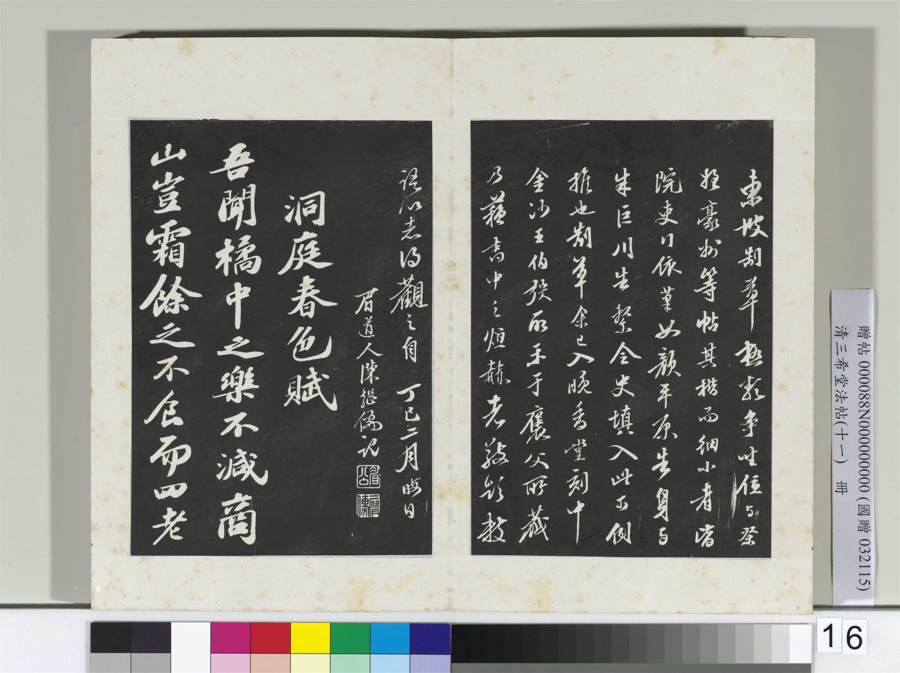
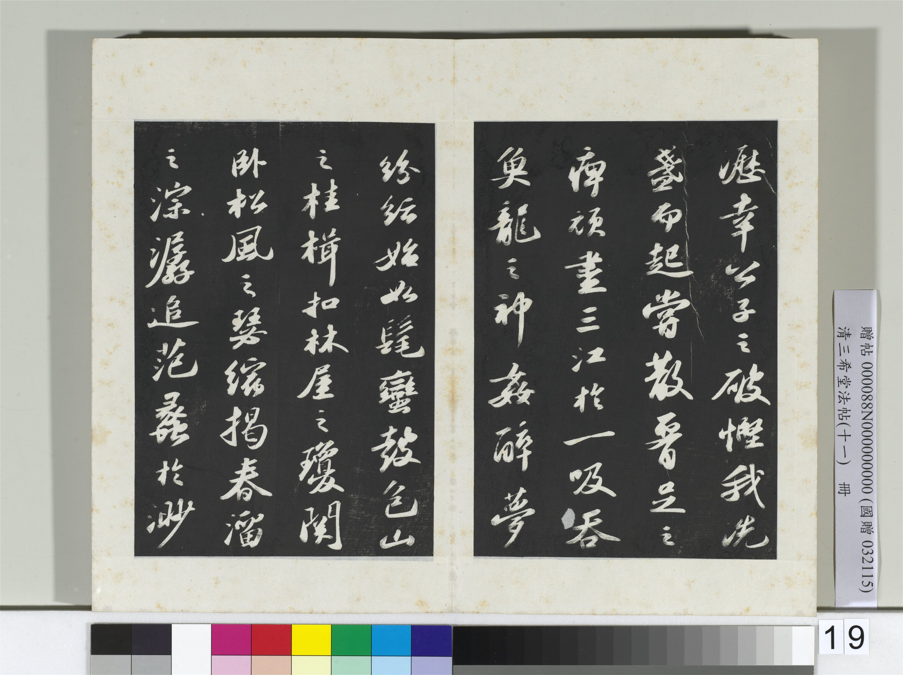
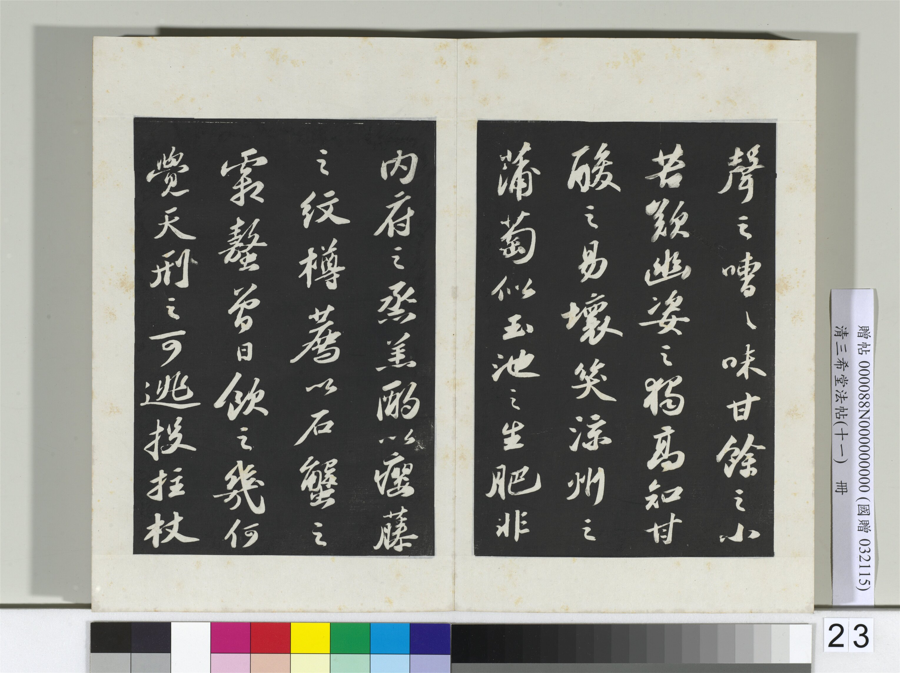
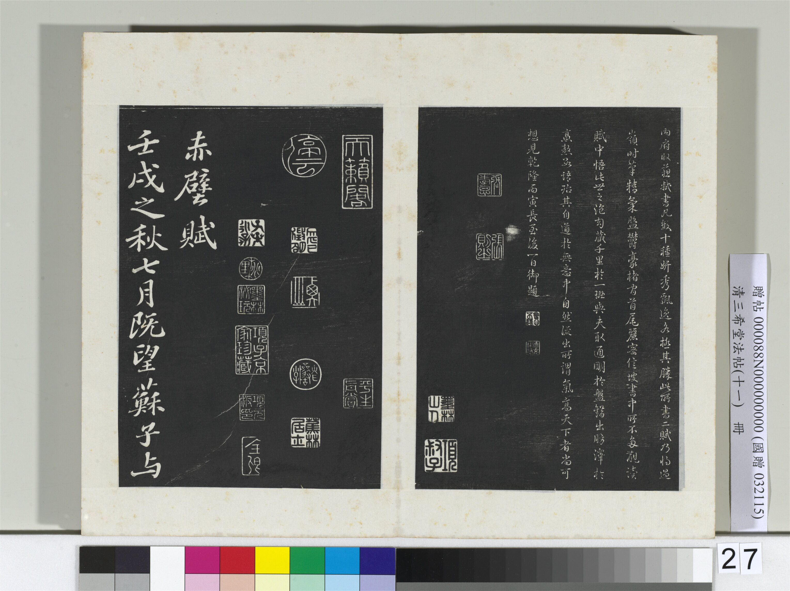

# 《洞庭春色、中山松醪二赋卷》学习笔记

## 基本信息

- 作品名：`《洞庭春色、中山松醪二赋卷》`
- 当前图像来源名称：`清三希堂法帖（十一） 册 宋苏轼书洞庭春色、中山松醪二赋卷`
- 收藏：国立故宫博物院
- 书体：行书
- 当前公开图像形态：法帖图版
- 文本内容：苏轼《洞庭春色赋》与《中山松醪赋》
- 书写时间：`绍圣元年闰四月二十一日`
- 所处阶段：再贬岭南途中，留襄邑时书写

## 图像资料

当前仓库先收录 4 张代表性图像，便于建立整体印象。需要注意：这里使用的是国立故宫博物院公开页面中的《三希堂法帖》图版，不等同于把原卷实物完整数字化后直接搬进仓库。

### 开篇

图注：作品开篇部分，适合先看整体气息是否已经呈现出晚年书风的收束与老辣。

### 中段一

图注：中段偏前位置，可留意行气推进时字距与行距的控制。

### 中段二

图注：中段偏后位置，适合和前段对比晚年书写中的紧密感与沉着感。

### 结尾

图注：作品收尾部分，可结合题记理解它与“将适岭表”的人生处境之间的关系。

## 背景

这件作品最值得注意的地方，是它把文学内容、人生处境和书法气息压缩在了同一个时刻里。国立故宫博物院公开释文中明白写到：“绍圣元年闰四月廿一日将适岭表。遇大雨留襄邑。书此。东坡居士记。”这说明它写于苏轼再遭贬谪、即将南迁岭外的时候。

也就是说，这不是顺境中的闲适作品，而是人生再度下行之际写下的文字。偏偏它写的内容又不是纯粹悲苦，而是《洞庭春色赋》《中山松醪赋》这样充满兴味、酒意、想象和文采的篇章。这种“处境沉重而精神不死”的反差，正是它特别值得读的地方。

## 为什么它重要

### 1. 它能帮助理解苏轼晚年书风

如果说《黄州寒食帖》更容易让人直接感到情绪推动下的起伏，那么《洞庭春色、中山松醪二赋卷》更适合用来看苏轼晚年笔墨中的老辣、收束和从容。它不靠夸张的外在变化取胜，而更像经过风浪之后沉下来、稳下来的书写。

### 2. 它体现了“文不随境死”

这件作品尤其能说明，苏轼在逆境里并不是只能写苦。他仍然可以写酒、写香气、写山水、写游兴，仍然能把精神世界打开。这一点对理解苏轼非常关键。

### 3. 它很适合和《黄州寒食帖》对读

两件作品都和贬谪有关，但气息并不一样。《黄州寒食帖》更像压抑中翻涌出来的真实书写；《洞庭春色、中山松醪二赋卷》则更像经历更多波折之后，文字和笔墨都多了一层控制力。

## 可以先这样看

### 1. 先读题记，再读正文

建议不要一上来就看赋文铺陈，而是先抓住题记中的“将适岭表”“遇大雨留襄邑”。这两句已经把整件作品的时间点和处境钉住了。

在这个前提下再读正文，会更容易体会到苏轼为什么仍然能写得这样有兴致、有气象。

### 2. 看晚年笔墨中的“紧”和“稳”

这件作品里很适合注意两件事：

- 结字往往更紧，不是松散外放那一路。
- 行气虽然流动，但整体不轻浮，带着更强的控制感。

这种状态很像一个经历过巨大起伏的人，不再用激烈姿态证明自己，而是在沉着里显出分量。

### 3. 看文字内容和书法气息是否形成反差

文本写酒、写香、写游、写想象，内容其实很开；但书写气息并不轻飘。正是这种反差，让这件作品非常耐读。

## 我会特别留意的几个观察点

### 1. 晚年的气息不是衰弱，而是收敛

苏轼晚年书法容易被误读成“年老所以慢下来”。但更准确的说法是：它变得更收敛、更内在，力量没有消失，只是不再外露得那么明显。

### 2. 文字中的兴味和处境中的沉重同时存在

这是这件作品最有张力的地方。一个即将远贬岭表的人，还能写出这样的文采和兴味，这不是简单的乐观，而是一种高度成熟的精神能力。

### 3. 它非常适合放进“由苏轼及己”的线索里

对你们这个仓库来说，这件作品很重要，因为它提醒人：真正有修养的人，不是处境好时才有风度，而是在处境坏时仍然能够保持表达、判断和审美能力。

## 对这个仓库特别有价值的地方

如果《黄州寒食帖》更像让人看到苏轼在低处时的真实震荡，那么《洞庭春色、中山松醪二赋卷》更像让人看到他在更深困局中的持续生长。

它展示的不是“没有痛苦”，而是“痛苦没有耗尽表达力”。这对长期学习苏轼来说，非常关键。

## 可继续补的方向

1. 补《洞庭春色赋》《中山松醪赋》全文和分段导读。
2. 单独整理题记中的时间、地点和贬谪背景。
3. 增加一节“与《黄州寒食帖》对读”，比较中年与晚年书风差异。
4. 后续如继续收图，可把 12 张公开图版全部收齐。

## 图像来源与说明

- 官方页面：`国立故宫博物院：清三希堂法帖（十一） 册 宋苏轼书洞庭春色、中山松醪二赋卷`
- 馆藏页面：`https://digitalarchive.npm.gov.tw/Collection/Detail/23021?dep=P`
- 本仓库当前保存的是官方公开图版中的代表性分段图。
- 图像使用时应遵守馆方页面公布的授权与署名要求。
