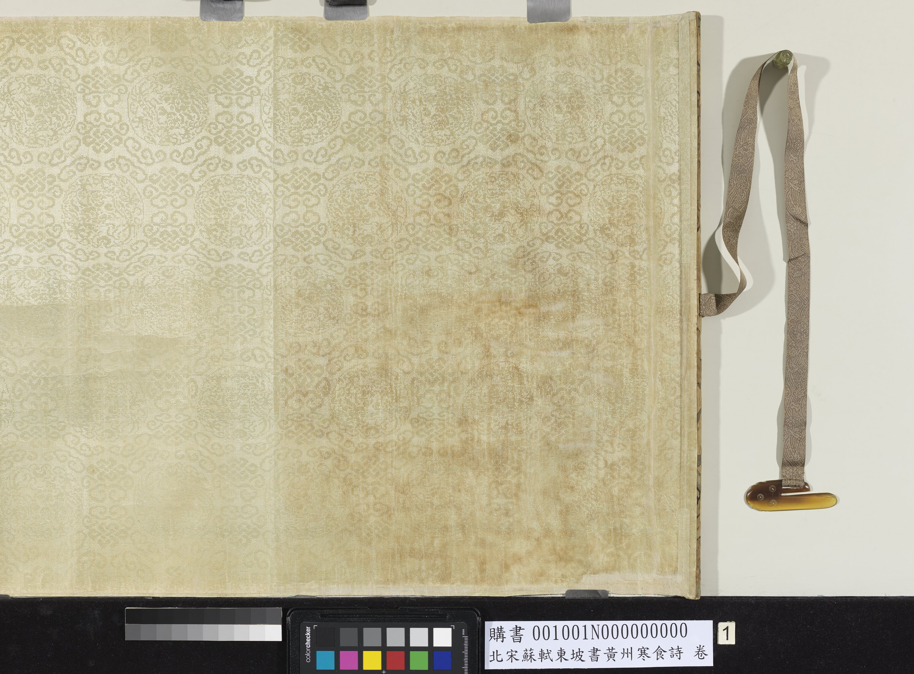
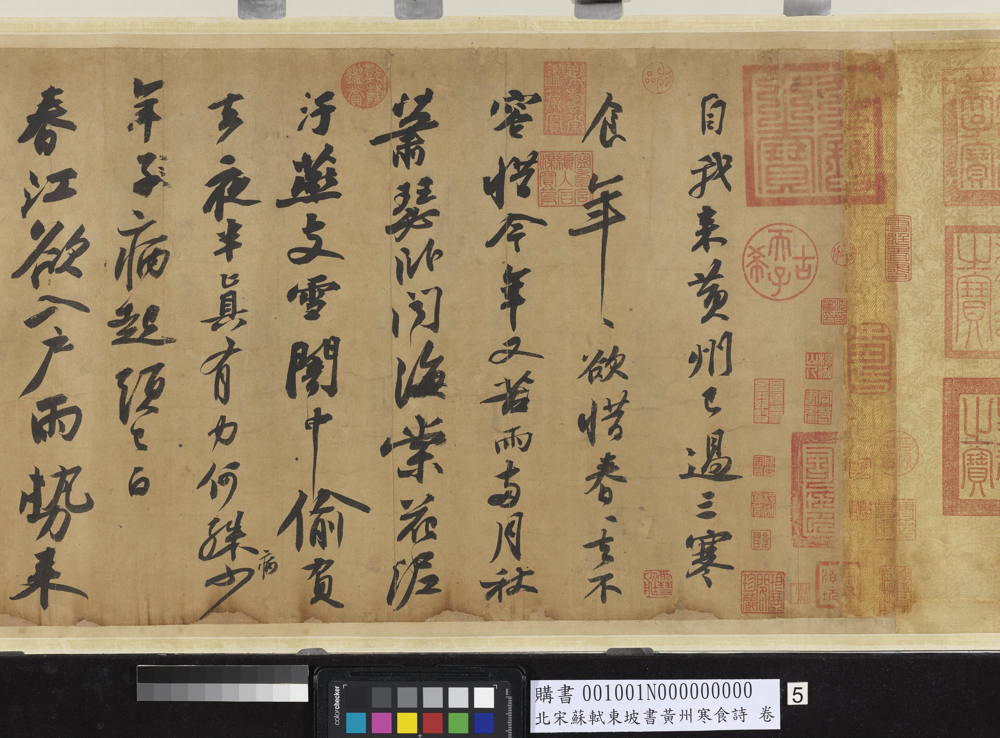
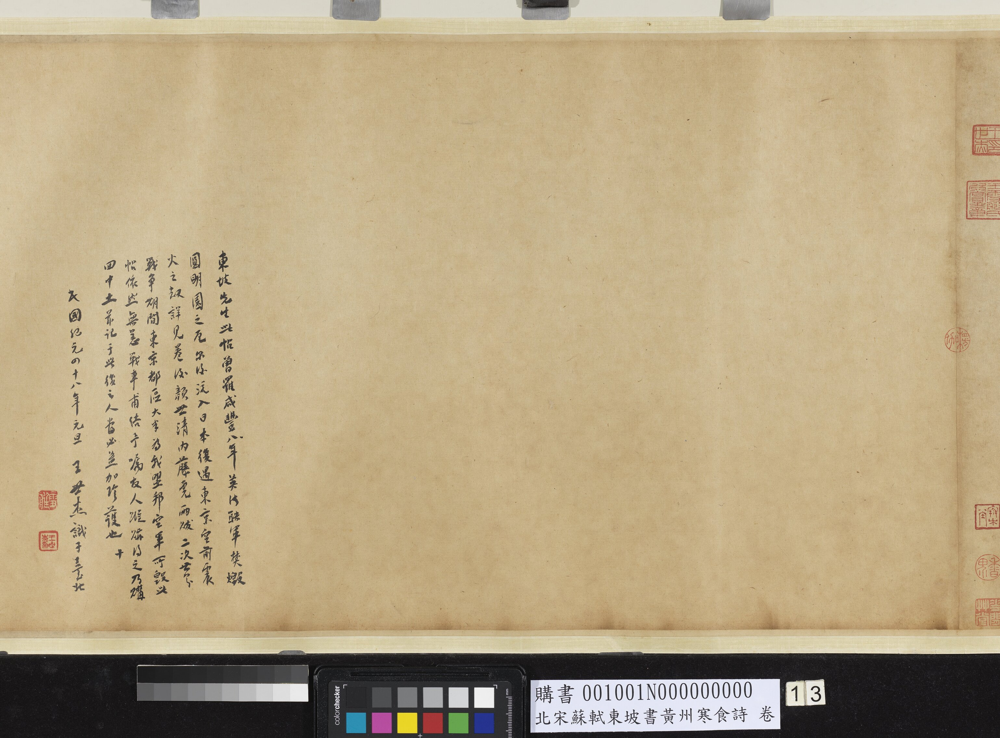
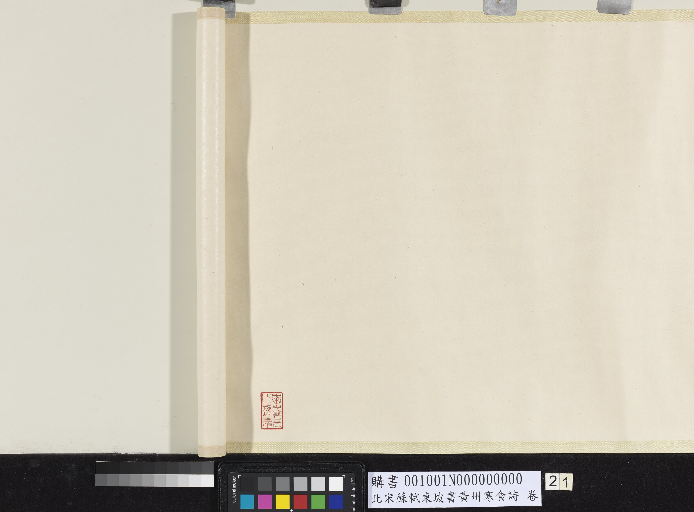
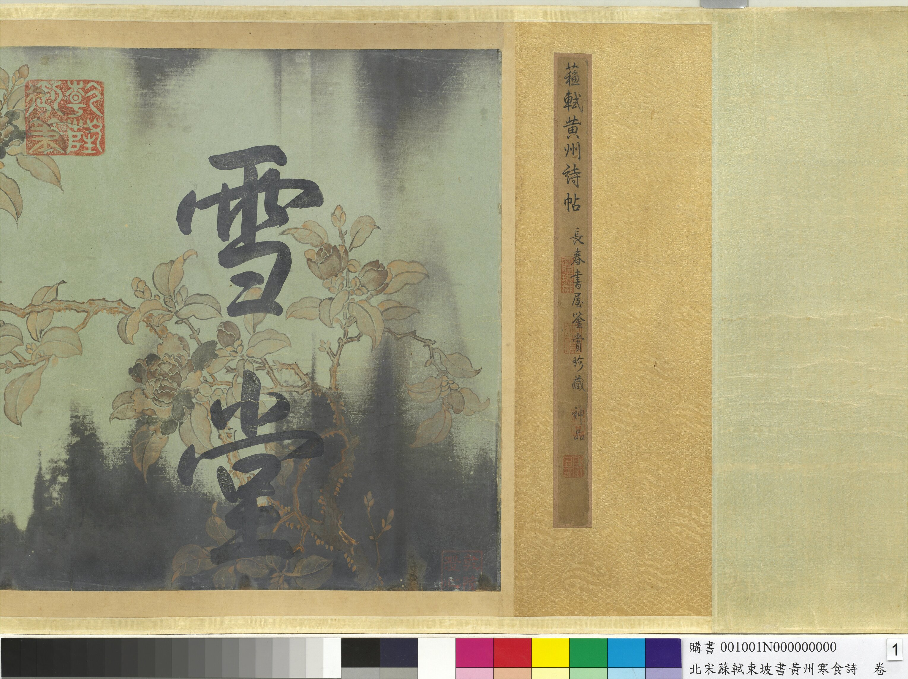

# 《黄州寒食帖》学习笔记

## 基本信息

- 作品名：`《黄州寒食帖》`
- 馆藏名称：`北宋苏东坡书黄州寒食诗卷`
- 收藏：国立故宫博物院
- 书体：行书
- 形制：卷
- 尺寸：本幅约 `34.2 x 199.5 cm`
- 文本内容：苏轼《黄州寒食诗二首》
- 所处阶段：黄州贬谪时期

## 图像资料

当前仓库先收录一组来自国立故宫博物院 IIIF 公开图像的代表性分段图，便于阅读和后续扩展。这里展示的是主卷与后跋的局部，不是整卷拼接图。

### 开篇

图注：主卷开篇部分，可先看整体行气如何展开。

### 中段一

图注：主卷中段偏前位置，已经能看到字势与情绪起伏开始增强。

### 中段二

图注：主卷中段偏后位置，节奏变化更加明显，适合和前段对照着看。

### 结尾

图注：主卷结尾部分，可结合全篇体会收束时的气息变化。

### 后跋示例

图注：后跋示例，便于观察后世题跋如何进入这件作品的传播与接受史。

## 背景

这件作品写于苏轼贬居黄州期间。国立故宫博物院公开资料给出的释文可见，诗中直接出现“自我来黄州。已过三寒食”等语句，作品的情绪与书写状态都和黄州生活密切相关。

寒食本来就是容易牵动身世之感的节令。对当时的苏轼来说，他已经远离政治中心，生活处境困顿，诗里既有寒食时节的凄清，也有对自身遭际的压抑感。这一点非常重要，因为《黄州寒食帖》不是单纯“写得好”的名作，而是诗、境、书三者高度合一的作品。

## 为什么它重要

### 1. 它几乎是理解苏轼书法的第一入口

如果只选一件作品来进入苏轼书法，大多数情况下都应先看《黄州寒食帖》。原因不是它名气最大而已，而是它足够集中地体现了苏轼书法中的几个核心特征：自然、沉着、起伏强、情绪推进明显，而且和人生处境高度绑定。

### 2. 它能同时看到“文”和“书”

这件作品写的是苏轼自己的诗，不是单纯抄录他人文章。读诗句本身，几乎就是理解书法节奏的一部分。也就是说，它非常适合你们这种“既想学苏轼其文，也想借苏轼提升自我”的仓库。

### 3. 后世评价极高

国立故宫博物院题跋资料显示，黄庭坚、董其昌等后世重要书家和鉴藏家都对这件作品评价极高。黄庭坚甚至认为，这件作品的完成状态非常难以再现，足见其在书法史中的分量。

## 可以先这样看

### 1. 先通读诗句，不急着先看字法

建议先把《黄州寒食诗二首》完整读一遍，体会其中的情绪变化，例如由苦雨、病起、空庖、破灶一路写到“死灰吹不起”的低沉。

如果不先进入文字内容，只把它当成纯书法作品来看，很容易只看见“名帖”，却看不见它真正的生命力来自哪里。

### 2. 再看整卷的行气

这件作品特别适合从整体去看，而不是一上来就拆单字。先注意它的气息是不是一直平稳，还是会忽紧忽松、忽欹忽正。你会发现，它并不是匀整漂亮那一路，而是带着明显波动。

这种波动恰恰是它最动人的地方。它不是刻意造险，而像是情绪推动下自然形成的节奏变化。

### 3. 最后再看局部笔意

看到局部时，可以留意几个点：

- 有些字显得特别紧，像把气压在里面。
- 有些行忽然被拉长，像情绪突然外放。
- 通篇并不追求秀润圆熟，而更重自然、涩劲和骨力。

这些特点合在一起，才构成《黄州寒食帖》的真正面貌。

## 我会特别留意的几个观察点

### 1. 沉郁感不是靠“慢”出来的

很多人第一次看会觉得这件作品“沉郁”。但它并不是均匀缓慢地沉下去，而是内里一直有力量在顶着。所以它不是软弱、塌陷的低沉，而是压抑中的张力。

### 2. 情绪推进很明显

这件作品很适合和苏轼其他较平和的作品对比。它的节奏起伏更明显，能看到情绪在书写过程中不断累积。也因此，它特别能让人感觉到“写字的人就在现场”。

### 3. 苏轼并不靠工稳取胜

看《黄州寒食帖》时，很容易明白苏轼为何不能只用“工整”或“法度”来衡量。他当然有深厚传统基础，但真正打动人的并不是规矩本身，而是规矩之内仍然充满活气。

## 对这个仓库特别有价值的地方

如果你们要把 EASS 做成“由苏轼及己”的长期项目，《黄州寒食帖》非常关键，因为它展示了一种很少见的能力：人在低处，文字和书法反而更接近真实，也更有力量。

它提醒人的不是“顺境时如何表现”，而是“困境中还能写出什么样的自己”。

## 可继续补的方向

1. 补《黄州寒食诗二首》全文和白话释义。
2. 结合黄州年表，把这件作品放回具体年份和经历里。
3. 增加一节“和《前赤壁赋》并读”，比较黄州时期不同文本中的精神状态。
4. 后续如果你们开始临习，可以再单开一节记录用笔和结字难点。

## 图像来源与说明

- 官方页面：`国立故宫博物院：北宋苏东坡书黄州寒食诗卷`
- IIIF Manifest：`https://digitalarchive.npm.gov.tw/Integrate/GetJson?cid=14714&dept=P`
- 馆藏页面：`https://digitalarchive.npm.gov.tw/Collection/Detail/23018?dep=P`
- 本仓库当前保存的是代表性分段图，原始长卷由馆方按分段提供。
